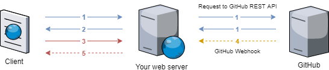
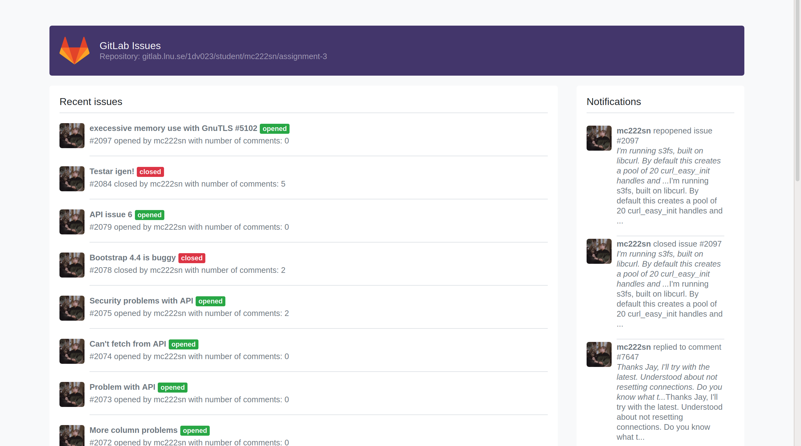

# GitLab Issues

## About

A real time web app using GitLab API to fetch JSON data and webhook to push JSON data to the project and update accordingly. It was built for a school assignment in LNU course 1dv032.

## Screenshot

## License

The license is MIT. You are free to do whatever you want with it.
